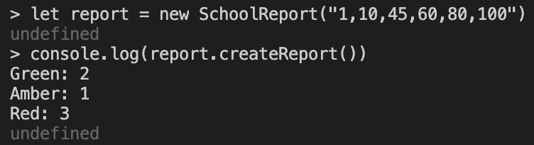

# School Report

Simple app to create a report based on student test results. Can be interacted with via a REPL.

Makers Academy process review task.

## How To Use

### Set up the project

Clone the repository:

```sh
git clone git@github.com:samanthagottlieb/school-report.git
```

Navigate to the directory:

```sh
cd school-report
```

Install dependencies:

```sh
npm install
```

### Run tests

Run:

```sh
npm test
```

### Run the app

Start the Node.js REPL:

```sh
node
```

Require the file into the REPL:

```sh
const SchoolReport = require('./src/school-report.js')
```

### Example Usage



## Specification

### Task

- Build an app to create a simple report on test results, helping teachers see how students did on tests
- Input: string of comma separated values with test results
- Output: string listing numbers of results falling withing each colour score category

### Scores

- Green: 75 - 100
- Amber: 50 - 74
- Red: 0 - 49
- Invalid: < 0 or > 100
- Raise error if incorrect input type

### Input | Output

| INPUT               | OUTPUT                              |
| ------------------- | ----------------------------------- |
| "0"                 | "Red: 1"                            |
| "50"                | "Amber: 1"                          |
| "75"                | "Green: 1"                          |
| "0,10"              | "Red: 2"                            |
| "0,50"              | "Amber: 1\nRed: 1"                  |
| "0,10,50"           | "Amber: 1\nRed: 2"                  |
| "1,10,45,60,80,100" | "Green: 2\nAmber: 1\nRed: 3"        |
| "-1"                | "Invalid: 1"                        |
| "a"                 | Raise error: "Incorrect input type" |
